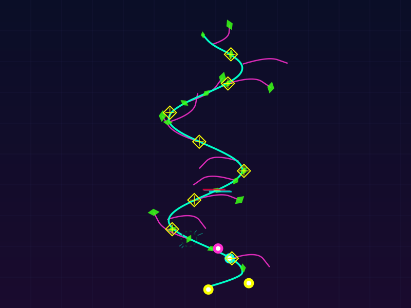

<div align="center">
  <h1>🌱 Repo Garden</h1>
</div>

<div align="center">
  <h3>Your commit history, growing quietly in your README — a bonsai that never redraws itself unless the history actually changed.</h3>
</div>

<div align="center">
  
  
  
  
  
</div>

<br>

<div align="center">
  
</div>

<br>

Repo Garden reads your repository's full git log and turns it into a
procedurally-generated botanical SVG, committed straight into your README.
Commits grow the trunk, new contributors bloom as blossoms, long silences
drop autumn leaves near the canopy, force-pushes snap a branch, and merges
leave a graft ring. Run it on a schedule and the art evolves as the repo
does — but only when the history actually changes.

```yaml
# .github/workflows/garden.yml
- uses: actions/checkout@v4
  with: { fetch-depth: 0 }
- uses: Aaryan1524/Bosnai@v1
  with: { biome: bonsai }
```

> [!TIP]
> Same git history always renders the same SVG, byte for byte. See
> [Determinism](#determinism) — it's the whole reason this doesn't spam
> your commit history on every scheduled run.

## Why use it?

- **Two steps, no server** — a README marker and a workflow file. No
  runtime, no database, no dashboard to keep alive; GitHub just renders a
  static image.
- **Deterministic by construction** — every random-looking curve is seeded
  from a SHA of the normalized event list. Nothing renders differently
  between runs unless the history did.
- **A real plugin system, not a config format** — biomes are typed
  TypeScript modules with a `render(garden) => svg` function, not a JSON
  theme file. Generative art needs loops and trig, not declarative config.
- **Untrusted code, sanitized output** — community biome output is
  validated and stripped of `<script>`, `on*` handlers, and any
  non-local/non-`data:` reference before it ever reaches your README.
- **Skips the noise** — if the rendered SVG is byte-identical to what's
  already committed, nothing is written, staged, or committed. A nightly
  cron on a quiet repo produces zero commits.

```
git log  →  history reader  →  neutral event list  →  biome  →  sanitized SVG  →  README
(input)     (core/history.ts)   (core/garden.ts)      (your pick)  (core/render.ts)  (committed)
```

## Example gallery

<div align="center">
  
  
</div>

Both images above are rendered from the *same* sample history — same
commits, same contributors, same gaps, same merges. Only the biome
differs, which is the point: the plugin interface holds across wildly
different aesthetics.

| Event         | Meaning                           | Bonsai                     | Neon Vine                     |
| ------------- | ---------------------------------- | --------------------------- | ------------------------------ |
| `growth`      | a commit                           | trunk/branch growth         | the vine climbs                |
| `bloom`       | a new contributor's first commit   | a blossom in the canopy     | a glowing node                 |
| `wither`      | a gap longer than the threshold    | falling autumn leaves       | a dashed "signal loss" ring    |
| `disruption`  | a force-push / history rewrite     | a snapped branch stub       | an RGB-split glitch bar        |
| `convergence` | a merge commit                     | a graft ring on the trunk   | a circuit-style junction node  |

## Install

### 1. Add a marker to your README

Add these two lines wherever you want the art to appear:

```html
<!-- repo-garden:start -->

<!-- repo-garden:end -->
```

If the markers are present, the action injects/updates an
`` reference between them on every run. If they're
absent, it just writes the SVG file to disk and you embed it yourself —
marker injection is the nicer UX, but not required.

### 2. Add a workflow

```yaml
name: Repo Garden
on:
  schedule: [{ cron: '0 3 * * *' }] # nightly
  push: { branches: [main] }
  workflow_dispatch:
permissions:
  contents: write
jobs:
  grow:
    runs-on: ubuntu-latest
    steps:
      - uses: actions/checkout@v4
        with: { fetch-depth: 0 } # full history — required
      - uses: Aaryan1524/Bosnai@v1
        with:
          biome: bonsai
```

**`fetch-depth: 0` is required** — a shallow checkout only has one commit
of history, and there's nothing to grow from. This exact file is also
committed at [`examples/workflow.yml`](examples/workflow.yml).

## Inputs

| Input                | Default               | What it does                                                    |
| --------------------- | ---------------------- | ----------------------------------------------------------------- |
| `biome`               | `bonsai`               | Which registered biome to render (`bonsai`, `neon-vine`, ...).    |
| `output-path`         | `garden.svg`           | Where the rendered SVG is written, relative to the repo root.     |
| `gap-threshold-days`  | `21`                   | Days of silence before a span counts as a `wither` event.         |
| `window`              | `all`                  | `all`, or a duration like `365d` to only render recent history.   |
| `width` / `height`    | *(biome default)*      | Optional pixel overrides for the rendered SVG's dimensions.       |
| `commit`              | `true`                 | If `false`, only writes the file and sets outputs — you commit it. |
| `github-token`        | `${{ github.token }}` | Token used to push the commit.                                    |

**Outputs:** `svg-path` (where the SVG was written) and `commit-sha` (empty
if nothing changed or `commit: false`).

## Determinism

Same git history produces a byte-identical SVG, every time. All
randomness flows through a seeded PRNG (mulberry32) initialized from a
SHA-256 of the normalized, sorted event list — never `Math.random()`,
never `Date.now()` inside the render path. This is enforced by a test
suite that builds a fixed fixture `Garden`, renders it twice, and asserts
the two SVG strings are identical, plus a second test that changes one
commit and asserts the output *does* change. It's the reason a nightly
cron job on an inactive repo produces zero commits instead of churning
your history with meaningless diffs.

## Writing a biome

Biomes are typed TypeScript modules, not a declarative theme format —
generative art needs real loops and trigonometry. The interface lives at
[`src/biomes/types.ts`](src/biomes/types.ts) (`Biome`, `defineBiome()`),
shared helpers (a seeded PRNG, color-ramp interpolation, SVG path
builders) live at [`src/biomes/kit.ts`](src/biomes/kit.ts), and the two
shipped biomes at `src/biomes/bonsai/` and `src/biomes/neon-vine/` are
the best reference implementations. A full walkthrough will live on the
project's docs site once it's deployed; for now, reading `neon-vine`
alongside `bonsai` is the fastest way to see how differently two biomes
can consume the identical `Garden` object.

## Known gaps

- **Force-push detection is best-effort, and mostly inert in CI.** It's
  derived from the local reflog, which only covers activity since the
  clone's HEAD was created. `actions/checkout` does a fresh clone, so in
  the common CI path there's no historical reflog to read — the check
  never throws, it just quietly finds nothing. It has a real chance of
  firing on a long-lived local clone or a self-hosted runner with
  persistent history, but don't expect `disruption` events to show up
  from a standard hosted-runner workflow.
- **No published docs site yet.** The "Write a biome" walkthrough
  referenced above doesn't have a deployed URL yet — read the source
  directly in the meantime.

## Tech stack

TypeScript, bundled to a single `dist/index.js` with `@vercel/ncc` (no
`node_modules` shipped, no install step for consumers). Git parsing via
`simple-git`; action scaffolding via `@actions/core`, `@actions/github`,
and `@actions/exec`. Tests via `vitest`.

## License

MIT — see [LICENSE](LICENSE).
